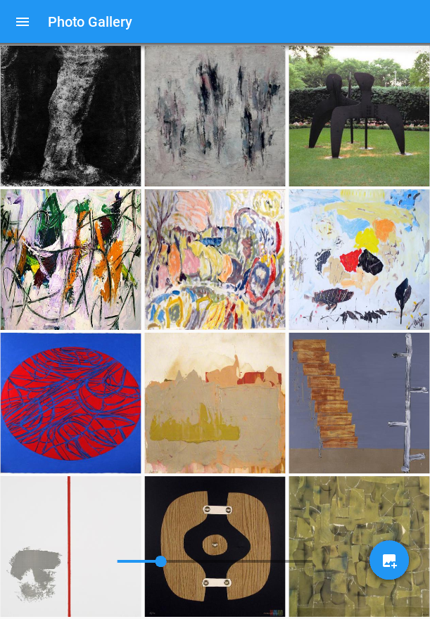
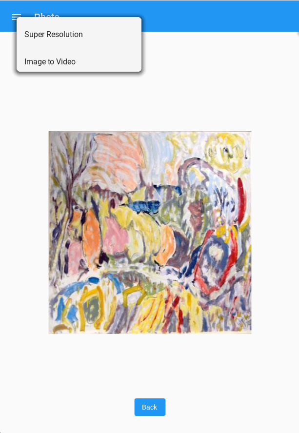

### Image APP ###

Simple demonstration using Kivy to show images and call different Deep Learning model

Made to work with : [https://github.com/maxgreat/Deep-Learning-server](https://github.com/maxgreat/AIModelServing)

Model URLs are stored in model_config.yml

## To run it on linux:

> pip install requirements.txt
> 
> python main.py

## To deploy it on android device
> buildozer android debug deploy run
